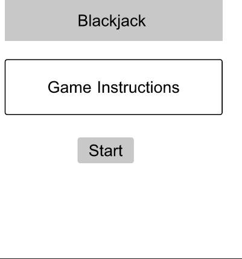
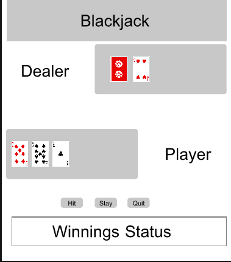
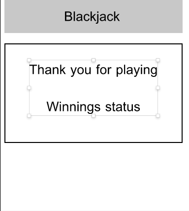

# MOD1 Project Game Proposal - Blackjack
# Stefani Baker

## Overview
Create a one player blackjack game.  Player plays against the computer.  Player places bets on hand.  As the player continues to play, the winnings accumulate.  Game ends when the player ends the game or runs out of money. 

## Rules of the Game
Dealer (computer) deals two cards face up to the player.  The dealer deals two cards to herself one face up and one face down.

The player has the choice to “stay” or “hit”.  The player can “hit” multiple times  until they reach or exceed 21.

The dealer plays after the player has finished.  The dealer reveals her hidden card.  The dealer must hit if her hand is less than 17.  At 17 or greater, the dealer must stay.

The winner is determined by the following rules:
> * If the player is dealt an Ace and a ten-value card (called a "blackjack" or "natural"), and the dealer does not, the player wins.
>* If the player exceeds a sum of 21 ("busts"); the player loses, even if the dealer also exceeds 21.
>* If the dealer exceeds 21 ("busts") and the player does not; the player wins.
>* If the player attains a final sum higher than the dealer and does not bust; the player wins.
>* If both dealer and player receive a blackjack or any other hands with the same sum, called a "push", no one wins.

The player receives 1.5 times the bet for a win and 2 times the bet for a natural blackjack (i.e. ace and facecard).  The player loses the bet if they lose.   For a push, the player keeps the bet.

The player can choose to stop the game.  The game ends if the player has no money.

## Technical Challenges
Displaying the active game using CSS.  Display cards and keeping all cards in a hand within it's div.  The number of cards is unknown.  As it grows, I need to make sure it remains inside the div.

## Wireframe

### Start

### Main

### End

## Timeline
*My timeline is aggresive because I want to get to the CSS while I have access to you on Wednesday.  If I am unable to get to CSS on Wednesday, I'll just get the MVP done and continue to explore CSS on my own.*
### Tuesday
    Get proposal approved.  Complete psuedocoding.  Start JS coding.
### Wednesday
    Complete JS coding and basic CSS by noon.  Start CSS exploration for additional stylizing.
### Thursday
    Continue CSS exploration.
### Friday
    Determine hard stop for CSS implementation.  Push final CSS exploration version to Github.
### Saturday
    Spend the 4th with family
### Sunday
    Explore more CSS.  If able, implement into final project.
### Monday
    Submit final project.
